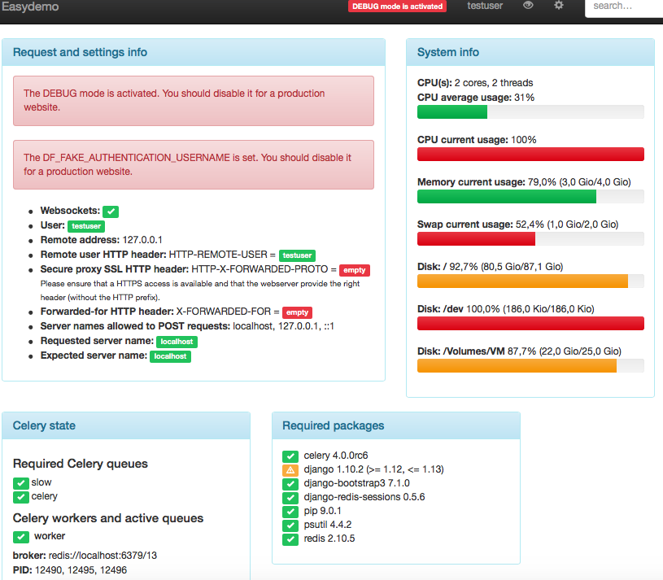

Monitoring view
===============

DjangoFloor provides a view to check if everything is ok.
This view is made of several widgets:

  * djangofloor.views.monitoring.RequestCheck: some infos on the HTTP request (server name, whether if websockets are working, …),
  * djangofloor.views.monitoring.System: system stats like CPU/mem/disk usage,
  * djangofloor.views.monitoring.CeleryStats: show Celery info like the connected workers and queues,
  * djangofloor.views.monitoring.Packages: dshow required and installed Python packages.

The list of widgets is defined in `settings.DF_SYSTEM_CHECKS`, so you can change the list of widgets. If this list is empty, then this view is disabled. Otherwise this view is only for superuser userssss.